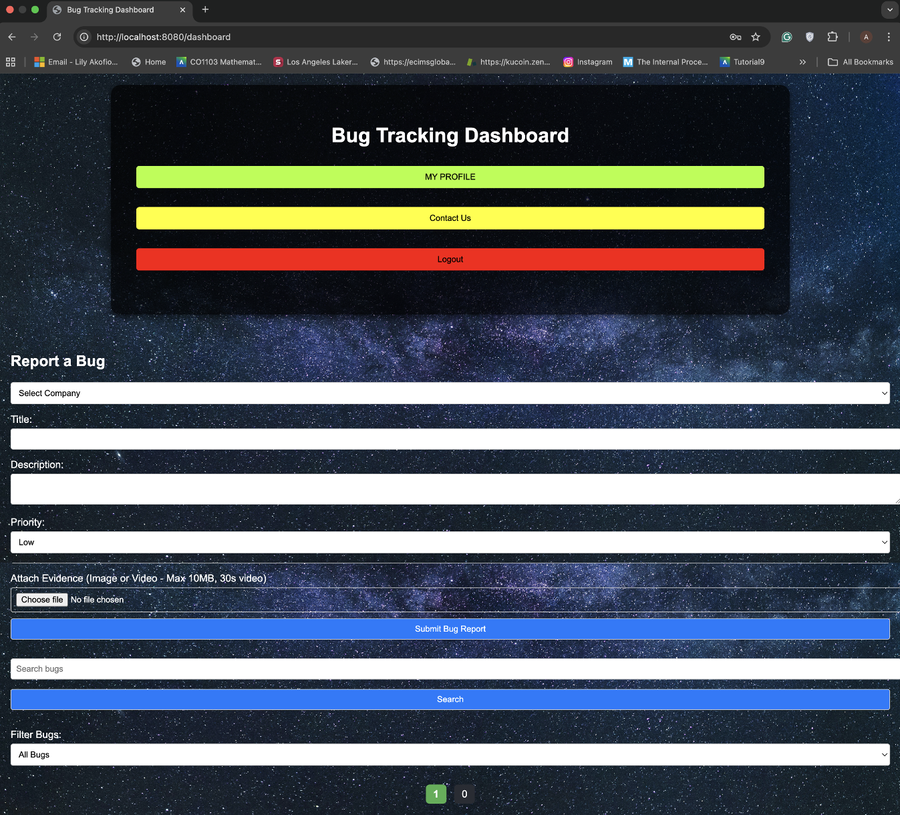
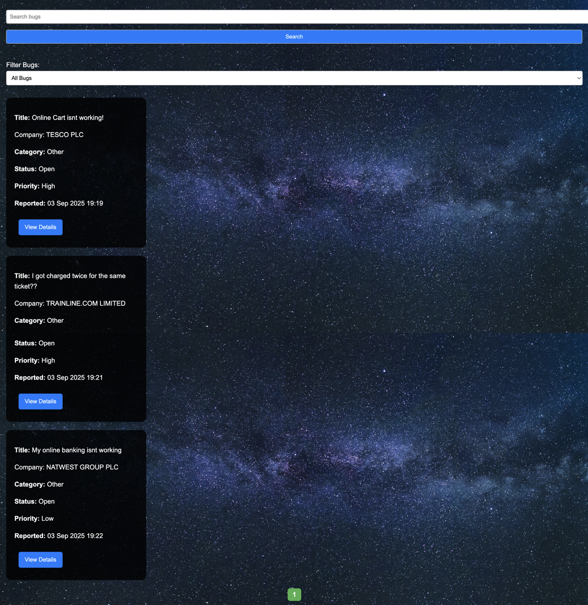

# 🐞 Software Bug Reporting & Tracking System  

A full-stack **bug reporting and tracking platform** built with **Java Spring Boot**, **Gradle**, and **MySQL**, featuring **duplicate detection with NLP** and **role-based access control**.  

  
  
  
  
  
  
  

---

## 📑 Table of Contents
- [Overview](#overview)  
- [Features](#features)  
- [Video Walkthrough](#video-walkthrough)  
- [Screenshots](#screenshots)  
- [Tech Stack](#tech-stack)  
- [Setup Instructions](#setup-instructions)  
- [How It Works](#how-it-works)  
- [Lessons Learned](#lessons-learned)  
- [Security Design](#security-design)  
- [Future Improvements](#future-improvements)  
- [Why This Project](#why-this-project)  
- [License](#license)  

---

## 🎥 Video Walkthrough  
👉 **Walkthrough Video Placeholder (to be added)**  

---

## 🚀 Features
- Secure login and registration with **BCrypt password hashing**  
- Role-based access control (**Admin / User / Overseer**)  
- Submit detailed bug reports with descriptions and metadata  
- Automatic bug classification (**UI, Performance, Security, etc.**)  
- Duplicate bug detection using **Cosine Similarity (NLP)**  
- Integration with **GOV.UK API**: Companies must enter their company number, verified against GOV.UK records (auto-fills details)  
- Track, update, and resolve bug reports via a dashboard  
- Contact form for user feedback  
- Multi-project/company support  

---

## 📸 Screenshots  

### 🔹 Welcome Page

### 🔹 Dashboard (Bug Submission Form)

### 🔹 Duplicate Bug Detection

### 🔹 Submitted Bugs

---

## 🛠 Tech Stack
- **Backend:** Java 19, Spring Boot 3  
- **Frontend:** Thymeleaf, HTML, CSS  
- **Database:** MySQL / H2 (in-memory option for testing)  
- **Security:** Spring Security, BCrypt password hashing, CSRF protection  
- **Duplicate Detection:** Cosine Similarity (NLP approach)  
- **Build Tool:** Gradle  

---

## ⚙️ Setup Instructions  

### 1. Clone repository

git clone https://github.com/AndyAkofioSowah/bug-tracking-system.git
cd bug-tracking-system

### 2. Configure database
Update application.properties:

properties
Copy code
spring.datasource.url=jdbc:mysql://localhost:3306/bugtracker
spring.datasource.username=root
spring.datasource.password=yourpassword

### 3. Run the app
bash
Copy code
./gradlew bootRun
Access via: http://localhost:8080

---

### 🔄 How It Works
Register/Login → Securely hashed passwords with role-based access.

Company Validation → When a company registers, its company number is checked against GOV.UK API. If valid, details are auto-filled.

Report Bugs → Submit detailed bug reports, classified automatically.

Duplicate Detection → System compares new bugs with existing ones using cosine similarity.

Track Progress → Bugs can be updated, resolved, or reopened.

Access Control → Admins manage projects, users submit reports, overseers monitor progress.

---

### 📚 Lessons Learned
While building this project, I tackled several complex challenges:

NLP Similarity: Implemented cosine similarity to detect duplicate bug reports, which required vectorizing text efficiently.

Role-Based Access Control: Managed different permissions (Admin/User/Overseer) with Spring Security.

Gradle Setup: Faced dependency conflicts that required careful management compared to Maven.

Spring Security Quirks: Debugged CSRF token errors in forms and ensured session security.

GOV.UK API Integration: Integrated external APIs for validating company numbers, requiring authentication keys and error handling.

This gave me experience in API integration, security design, and applying NLP techniques in real-world web apps.

---

### 🔒 Security Design
Passwords → Hashed with BCrypt

Access Control → Role-based (Admin/User/Overseer)

CSRF Protection → Enabled via Spring Security

Sessions → Secure session handling with ID rotation on login

External API Handling → GOV.UK integration with proper key storage

---

### 🚀 Future Improvements
Dockerize the application for easier setup

Add REST API endpoints for bug submission & retrieval

Support SSO integration (e.g., OAuth2, Google login)

Expand company signup beyond UK-only (remove GOV.UK limitation)

Add bug analytics dashboard & visualizations

---

### 💡 Why This Project?
This project demonstrates my ability to:

Build full-stack web applications with real-world QA workflows

Apply NLP techniques for duplicate detection

Design systems with secure authentication & role-based access

Integrate with external APIs (GOV.UK)

It’s a showcase of combining software engineering, security practices, and machine learning concepts to solve practical problems in software quality assurance.

---

### 📜 License
MIT License – free to use & adapt.

---

